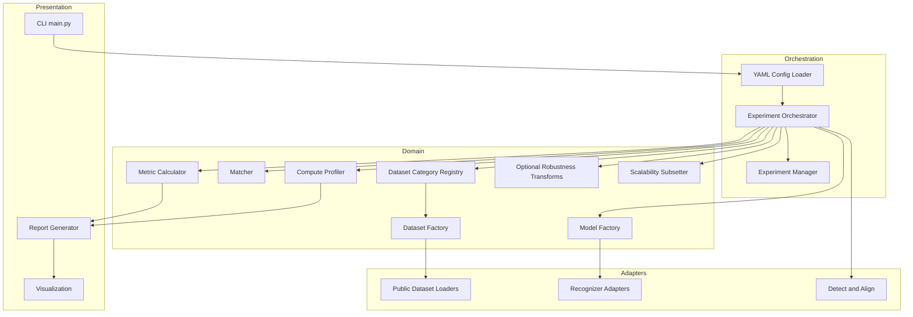
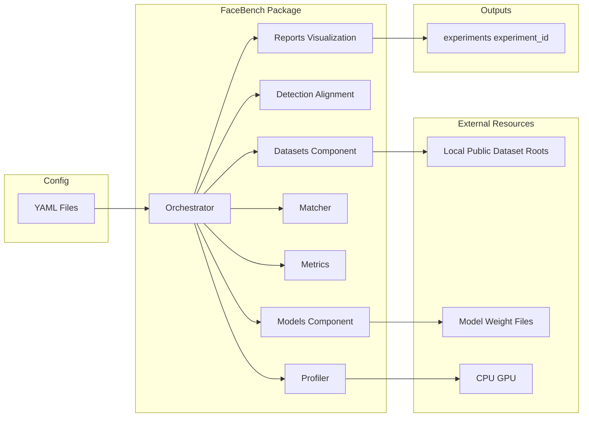
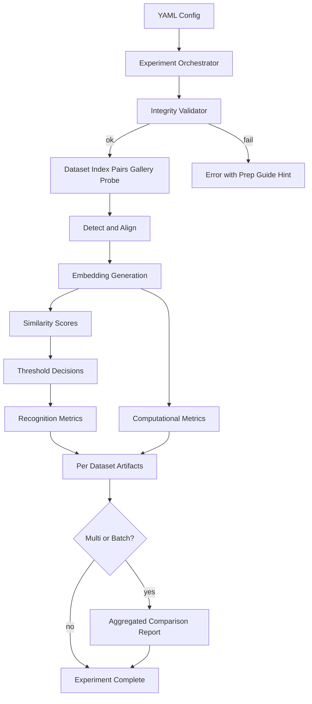
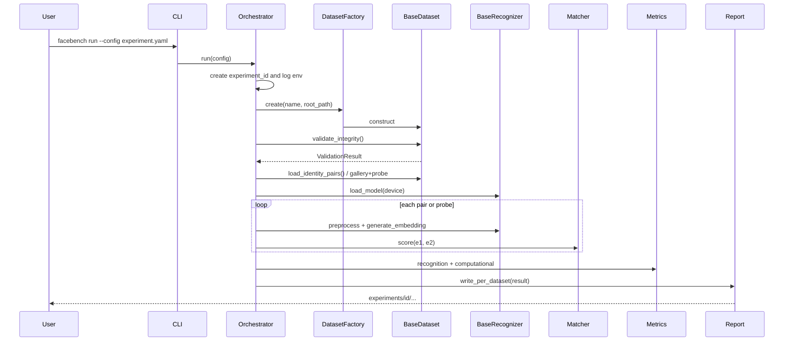
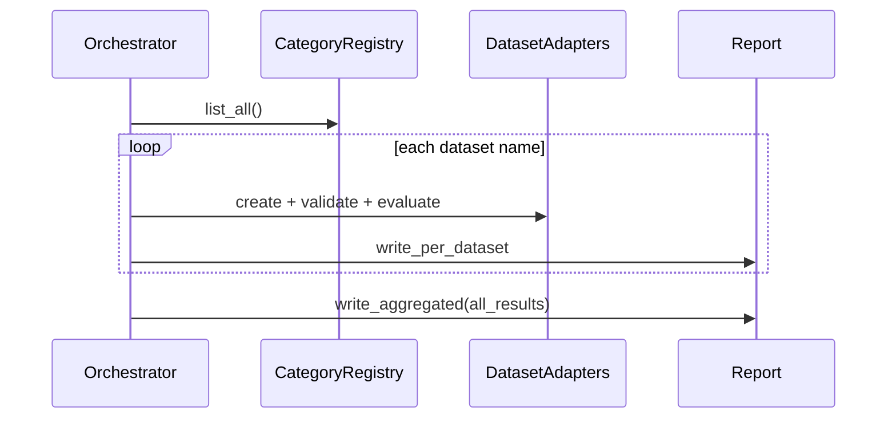
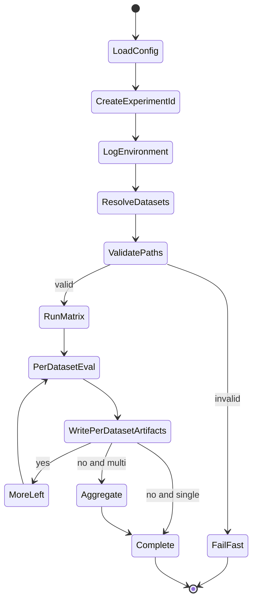

# FaceBench: Research Architecture and Design Document

**Project Title:** FaceBench — A Unified Benchmarking Framework for Comparative Evaluation of Modern Deep Face Recognition Models

**Document Type:** Research Architecture & Software Design (pre-implementation)

**Status:** Design for review — no implementation code until approved

**Audience:** Scopus / Q1 journal preparation; open-source research release path

**Related briefs:** [chatgpt-conversion.md](chatgpt-conversion.md), [dataset-suggestion.md](dataset-suggestion.md)

---

## Table of Contents

1. [Project Scope](#1-project-scope)
2. [Research Novelty](#2-research-novelty)
3. [Literature Gap](#3-literature-gap)
4. [Research Questions](#4-research-questions)
5. [Proposed Contributions](#5-proposed-contributions)
6. [Functional Requirements](#6-functional-requirements)
7. [Non-Functional Requirements](#7-non-functional-requirements)
8. [System Architecture](#8-system-architecture)
9. [Folder Structure](#9-folder-structure)
10. [UML Class Diagram](#10-uml-class-diagram)
11. [Component Diagram](#11-component-diagram)
12. [Data Flow Diagram](#12-data-flow-diagram)
13. [Sequence Diagram](#13-sequence-diagram)
14. [Configuration Design](#14-configuration-design)
15. [Experiment Workflow](#15-experiment-workflow)
16. [Evaluation Methodology](#16-evaluation-methodology)
17. [Module Responsibilities](#17-module-responsibilities)
18. [Technology Stack](#18-technology-stack)
19. [Risk Analysis](#19-risk-analysis)
20. [Future Extensions](#20-future-extensions)
21. [Git Branch Strategy](#21-git-branch-strategy)
22. [Testing Strategy](#22-testing-strategy)
23. [Documentation Plan](#23-documentation-plan)
24. [Milestone-Based Development Roadmap](#24-milestone-based-development-roadmap)

---

## 1. Project Scope

### 1.1 In Scope

FaceBench is an independent, modular Python benchmarking framework for **comparative evaluation** of pretrained deep face recognition models under an identical protocol.

| Area | Scope |
|------|--------|
| Models (v1) | FaceNet, Dlib Face Recognition, Buffalo-L (InsightFace), AdaFace, MagFace |
| Datasets (v1) | LFW, CFP-FP, CPLFW, AgeDB-30, TinyFace, AR Face, ChokePoint, YouTube Faces (YTF) |
| Matching | Cosine similarity, Euclidean distance; configurable thresholds |
| Recognition metrics | Accuracy, Precision, Recall, F1, Confusion Matrix, ROC, AUC, FAR, FRR, EER |
| Computational metrics | Inference time, embedding time, latency, FPS, CPU/GPU/RAM/VRAM usage, load time, model size |
| Robustness | (a) Category-organized public datasets; (b) optional synthetic transforms on a public base (e.g. LFW) |
| Scalability | Identity ladders (10 → 100 → 500 → 1000 → 5000) via **subsets of public galleries only** |
| Experiment modes | Single dataset, multi-dataset, batch-all |
| Reports | HTML, Markdown, CSV, JSON, publication-ready figures; per-dataset + aggregated |
| Config | YAML-driven experiments |

### 1.2 Out of Scope (v1)

- Training or fine-tuning face recognition models
- **Custom datasets** and **user-provided identity collections**
- Bundling or auto-downloading copyrighted datasets into the repository
- Coupling to any surveillance application (including VISTA)
- Deployment as a production recognition service
- Face detection model bake-offs as a primary research contribution (detection/alignment is a controlled pipeline stage, not the comparison target)

### 1.3 Independence Principle

FaceBench must remain a reusable external library. Downstream projects (including VISTA) may consume FaceBench; FaceBench must not import or depend on those projects.

### 1.4 Dataset Policy (Non-Negotiable)

1. Only well-established **public** evaluation datasets.
2. Datasets live on the user’s machine; paths are supplied via YAML.
3. The framework **validates** expected layout and reports missing files with preparation guidance.
4. Future datasets may be added via the `BaseDataset` interface; private/custom galleries are not first-class v1 features.

---

## 2. Research Novelty

FaceBench’s novelty is the combination of:

1. **Unified multi-axis evaluation** — accuracy, computational cost, category-structured public-dataset robustness, optional synthetic degradation, and gallery-size scalability under one protocol.
2. **Software artifact as research contribution** — a modular, reproducible, YAML-configurable open framework rather than a one-off experimental script.
3. **Category-organized multi-dataset benchmarking** — pose, age, low resolution, occlusion, surveillance, and video axes mapped to accepted public sets, with automatic per-dataset and cross-dataset reporting.
4. **Replaceable model and dataset strategies** — Strategy + Factory patterns so new recognizers and public datasets plug in without changing the evaluation core.
5. **Publication-oriented automation** — IEEE/Springer-ready figures and structured experiment versioning for transparent reproduction.

---

## 3. Literature Gap

Existing face recognition comparison studies and toolkits commonly exhibit one or more of the following limitations:

| Gap | Typical practice | FaceBench response |
|-----|------------------|--------------------|
| Accuracy-only reporting | Verification accuracy / TAR@FAR | Full recognition + compute + robustness axes |
| Narrow model sets | 2–3 models | Classical + modern generation (5 in v1; extensible) |
| Ad hoc protocols | Different preprocess / align / match settings | Shared pipeline and config |
| Non-reproducible scripts | Private notebooks, missing seeds/hardware logs | Experiment IDs, env logging, YAML configs |
| Missing software release | Paper tables only | Reusable benchmarking library |
| Unstructured datasets | Flat “run on LFW” | Category registry + multi-dataset batch + aggregation |
| Custom private data in papers | Hard to reproduce | Public datasets only; documented prep |

FaceBench is designed to close these gaps for comparative evaluation research suitable for journal submission.

---

## 4. Research Questions

| ID | Research Question | Primary evidence |
|----|-------------------|------------------|
| **RQ1** | Which model achieves the highest recognition performance under a fixed protocol across public benchmarks? | Accuracy, F1, AUC, EER on LFW and category datasets |
| **RQ2** | Which model is fastest and least resource-intensive? | Latency, FPS, CPU/GPU/RAM/VRAM, model size |
| **RQ3** | Which model is most robust across challenge categories (pose, age, low-res, occlusion, surveillance, video)? | CFP-FP, CPLFW, AgeDB-30, TinyFace, AR Face, ChokePoint, YTF |
| **RQ4** | How does recognition accuracy and speed scale as enrolled identities increase? | Public-gallery identity ladders 10→5000 |
| **RQ5** | Which model is most suitable for real-time / constrained-resource applications? | Joint accuracy–latency–resource Pareto analysis |

Optional synthetic robustness (blur, noise, JPEG, illumination, rotation) on LFW supports secondary analyses under RQ3 without introducing custom identity data.

---

## 5. Proposed Contributions

1. **FaceBench framework** — modular, open, pretrained-model benchmarking library independent of any application stack.
2. **Unified evaluation protocol** — identical detect → align → embed → match → metric pipeline for all models.
3. **Category-structured public dataset suite** — eight established datasets mapped to research categories, with YAML path management and integrity validation.
4. **Multi-axis metric suite** — recognition, computational, robustness, and scalability measures with automated reporting.
5. **Empirical comparative study** — reproducible results for FaceNet, Dlib, Buffalo-L, AdaFace, and MagFace across the suite (paper experiments).
6. **Publication tooling** — automated figures/tables and experiment versioning to support Scopus/Q1 manuscript preparation.

---

## 6. Functional Requirements

### 6.1 Core Pipeline

| ID | Requirement |
|----|-------------|
| FR-01 | Load experiment configuration from YAML |
| FR-02 | Resolve dataset by name via category registry |
| FR-03 | Validate `dataset.root_path` layout and required metadata files |
| FR-04 | Load images and identity/verification pairs through `BaseDataset` |
| FR-05 | Run face detection and alignment as a shared preprocessing stage |
| FR-06 | Instantiate recognizers via factory from config `model.name` |
| FR-07 | Generate embeddings through `BaseRecognizer.generate_embedding` |
| FR-08 | Match embeddings with cosine and/or Euclidean similarity |
| FR-09 | Apply configurable decision thresholds |
| FR-10 | Compute recognition metrics (Accuracy, Precision, Recall, F1, CM, ROC, AUC, FAR, FRR, EER) |
| FR-11 | Profile computational metrics during runs |
| FR-12 | Generate per-dataset HTML/Markdown/CSV/JSON reports and figures |
| FR-13 | Generate aggregated cross-dataset comparison reports for multi/batch runs |
| FR-14 | Assign unique experiment IDs and persist configs + environment metadata |
| FR-15 | Support single, multi, and batch-all dataset experiment modes |

### 6.2 Dataset Interface

Every dataset adapter implements:

| Method | Responsibility |
|--------|----------------|
| `load_dataset()` | Discover and index images / identities |
| `load_identity_pairs()` | Verification pairs (same/different) where applicable |
| `load_gallery()` | Enrollment / gallery set |
| `load_probe()` | Probe / query set |
| `preprocess()` | Dataset-specific path or label normalization before shared detect/align |

### 6.3 Model Interface

Every recognizer implements:

| Method | Responsibility |
|--------|----------------|
| `load_model()` | Load weights / ONNX / runtime |
| `preprocess()` | Model-specific tensor prep (size, normalize) |
| `generate_embedding()` | Produce L2-ready or model-native embedding |
| `compare()` | Score two embeddings under selected similarity |
| `predict()` | Thresholded same/different or identity decision |

### 6.4 Dataset Categories (v1)

| Category | Datasets |
|----------|----------|
| General | LFW |
| Pose | CFP-FP, CPLFW |
| Age | AgeDB-30 |
| Low resolution | TinyFace |
| Occlusion / illumination | AR Face |
| Surveillance | ChokePoint |
| Video | YouTube Faces (YTF) |

### 6.5 Optional Axes

| ID | Requirement |
|----|-------------|
| FR-16 | Optional synthetic robustness transforms on a public base dataset |
| FR-17 | Scalability evaluation by subsetting public gallery identities |

---

## 7. Non-Functional Requirements

| ID | Category | Requirement |
|----|----------|-------------|
| NFR-01 | Reproducibility | Same YAML + same hardware/software log ⇒ comparable results; seeds logged where stochastic |
| NFR-02 | Modularity | Models, datasets, matchers, metrics replaceable without core changes |
| NFR-03 | Extensibility | New public dataset or model = new adapter + registry entry |
| NFR-04 | Independence | No dependency on VISTA or other application codebases |
| NFR-05 | Configurability | Behavior controlled by YAML, not hardcoded paths or thresholds |
| NFR-06 | Observability | Structured logs for hardware, OS, CUDA, Python, library versions, errors, timings |
| NFR-07 | Measurement fidelity | Profiling overhead documented; warm-up iterations for latency/FPS |
| NFR-08 | License awareness | Dataset prep docs state access/license constraints; no redistribution of datasets |
| NFR-09 | Usability | Clear errors for missing dataset files with links to prep guides |
| NFR-10 | Maintainability | SOLID, Strategy, Factory; typed interfaces; unit + contract tests |
| NFR-11 | Portability | CPU and GPU (CUDA) via config `device` |
| NFR-12 | Publication quality | Figures sized/styled for IEEE/Springer defaults |

---

## 8. System Architecture

FaceBench uses a layered architecture with dependency inversion toward interfaces (`BaseRecognizer`, `BaseDataset`, `BaseMatcher`, `BaseMetric`).



### 8.1 Layer Responsibilities

| Layer | Role |
|-------|------|
| Presentation | CLI entry, report/figure emission |
| Orchestration | Config load, experiment lifecycle, IDs, batching |
| Domain | Protocol logic, registries, factories, metrics, profiling |
| Adapters | Concrete datasets, models, detection/alignment backends |

### 8.2 Design Patterns

- **Strategy:** `BaseRecognizer`, `BaseDataset`, similarity methods
- **Factory:** model and dataset construction from YAML names
- **Registry:** dataset category → dataset implementations
- **Dependency injection (light):** orchestrator receives interfaces, not concretes
- **Template method (optional):** shared evaluation loop with hooks for gallery/probe vs pairs

---

## 9. Folder Structure

```text
FaceBench/
├── facebench/
│   ├── __init__.py
│   ├── main.py
│   ├── core/
│   │   ├── orchestrator.py
│   │   ├── experiment_manager.py
│   │   ├── config_loader.py
│   │   └── registry.py
│   ├── datasets/
│   │   ├── base.py                 # BaseDataset
│   │   ├── category_registry.py
│   │   ├── integrity.py            # path / layout validation
│   │   ├── lfw/
│   │   ├── cfp_fp/
│   │   ├── cplfw/
│   │   ├── agedb/
│   │   ├── tinyface/
│   │   ├── ar_face/
│   │   ├── chokepoint/
│   │   └── ytf/
│   ├── models/
│   │   ├── base.py                 # BaseRecognizer
│   │   ├── factory.py
│   │   ├── facenet/
│   │   ├── dlib_fr/
│   │   ├── buffalo_l/
│   │   ├── adaface/
│   │   └── magface/
│   ├── detection/
│   │   └── align.py
│   ├── matcher/
│   │   ├── base.py
│   │   ├── cosine.py
│   │   └── euclidean.py
│   ├── metrics/
│   │   ├── recognition.py
│   │   └── computational.py
│   ├── evaluation/
│   │   ├── verification.py
│   │   ├── identification.py
│   │   ├── robustness.py           # optional synthetic transforms
│   │   └── scalability.py
│   ├── visualization/
│   │   └── figures.py
│   ├── reports/
│   │   ├── html_report.py
│   │   ├── markdown_report.py
│   │   └── exporters.py            # CSV / JSON
│   └── utils/
│       ├── logging.py
│       ├── env_info.py
│       └── timing.py
├── configs/
│   ├── examples/
│   │   ├── lfw_buffalo.yaml
│   │   ├── batch_all_models.yaml
│   │   └── scalability_agedb.yaml
│   └── schemas/                    # optional JSON Schema for YAML
├── experiments/                    # run outputs (gitignored content)
├── tests/
│   ├── unit/
│   ├── contract/
│   └── fixtures/                   # tiny synthetic pair layouts (not real faces)
├── docs/
│   ├── FaceBench-Design.md         # this document
│   ├── chatgpt-conversion.md
│   ├── dataset-suggestion.md
│   └── datasets/                   # per-dataset preparation guides
│       ├── lfw.md
│       ├── cfp_fp.md
│       ├── cplfw.md
│       ├── agedb.md
│       ├── tinyface.md
│       ├── ar_face.md
│       ├── chokepoint.md
│       └── ytf.md
├── pyproject.toml
├── README.md
└── LICENSE
```

---

## 10. UML Class Diagram

```mermaid
classDiagram
  direction TB

  class BaseDataset {
    <<abstract>>
    +name: str
    +category: str
    +root_path: Path
    +load_dataset() DatasetIndex
    +load_identity_pairs() List~Pair~
    +load_gallery() List~Sample~
    +load_probe() List~Sample~
    +preprocess(sample) Sample
    +validate_integrity() ValidationResult
  }

  class LFWDataset
  class CFPFPDataset
  class CPLFWDataset
  class AgeDBDataset
  class TinyFaceDataset
  class ARFaceDataset
  class ChokePointDataset
  class YTFDataset

  BaseDataset <|-- LFWDataset
  BaseDataset <|-- CFPFPDataset
  BaseDataset <|-- CPLFWDataset
  BaseDataset <|-- AgeDBDataset
  BaseDataset <|-- TinyFaceDataset
  BaseDataset <|-- ARFaceDataset
  BaseDataset <|-- ChokePointDataset
  BaseDataset <|-- YTFDataset

  class DatasetFactory {
    +create(name, root_path) BaseDataset
  }

  class CategoryRegistry {
    +get_category(name) str
    +list_by_category(category) List~str~
    +list_all() List~str~
  }

  class BaseRecognizer {
    <<abstract>>
    +name: str
    +embedding_dim: int
    +load_model(device)
    +preprocess(image) Tensor
    +generate_embedding(image) ndarray
    +compare(e1, e2, method) float
    +predict(e1, e2, threshold, method) bool
  }

  class FaceNetRecognizer
  class DlibRecognizer
  class BuffaloLRecognizer
  class AdaFaceRecognizer
  class MagFaceRecognizer

  BaseRecognizer <|-- FaceNetRecognizer
  BaseRecognizer <|-- DlibRecognizer
  BaseRecognizer <|-- BuffaloLRecognizer
  BaseRecognizer <|-- AdaFaceRecognizer
  BaseRecognizer <|-- MagFaceRecognizer

  class ModelFactory {
    +create(name, device) BaseRecognizer
  }

  class BaseMatcher {
    <<abstract>>
    +score(e1, e2) float
  }

  class CosineMatcher
  class EuclideanMatcher
  BaseMatcher <|-- CosineMatcher
  BaseMatcher <|-- EuclideanMatcher

  class ExperimentOrchestrator {
    +run(config) ExperimentResult
    +run_batch(config) AggregatedResult
  }

  class MetricCalculator {
    +recognition(y_true, y_score, threshold) RecognitionMetrics
    +computational(profile) ComputationalMetrics
  }

  class ComputeProfiler {
    +start()
    +stop() Profile
  }

  class ReportGenerator {
    +write_per_dataset(result)
    +write_aggregated(results)
  }

  DatasetFactory --> BaseDataset
  CategoryRegistry --> DatasetFactory
  ModelFactory --> BaseRecognizer
  ExperimentOrchestrator --> DatasetFactory
  ExperimentOrchestrator --> ModelFactory
  ExperimentOrchestrator --> BaseMatcher
  ExperimentOrchestrator --> MetricCalculator
  ExperimentOrchestrator --> ComputeProfiler
  ExperimentOrchestrator --> ReportGenerator
```



---

## 11. Component Diagram



---

## 12. Data Flow Diagram



**Optional branches**

- **Synthetic robustness:** after Align (or before), apply transform schedule; repeat Emb→Metrics per transform.
- **Scalability:** before gallery load, subset identities to ladder size N.

---

## 13. Sequence Diagram

### 13.1 Single-dataset experiment



### 13.2 Batch-all datasets



---

## 14. Configuration Design

### 14.1 Principles

- One YAML file = one experiment definition (or batch definition).
- Dataset selection requires **only** config changes, not code changes.
- `root_path` is mandatory for every dataset entry.
- Secrets/weights paths are local; never commit personal absolute paths in shared example configs (use placeholders).

### 14.2 Example — single dataset

```yaml
experiment:
  name: lfw_buffalo_l_cosine
  output_dir: experiments
  seed: 42

device: cuda:0   # or cpu
batch_size: 32

dataset:
  name: LFW
  root_path: /data/datasets/lfw
  # optional protocol file override if needed
  # pairs_file: pairs.txt

model:
  name: buffalo_l
  weights_path: /data/weights/buffalo_l   # if required by adapter

matching:
  method: cosine          # cosine | euclidean
  threshold: 0.40

evaluation:
  mode: verification      # verification | identification
  compute_metrics: true
  profile_resources: true

robustness:
  enabled: false
  # when enabled, base must be a public dataset (typically LFW)
  transforms: [blur, gaussian_noise, jpeg, low_illumination]

scalability:
  enabled: false
  identity_counts: [10, 100, 500, 1000, 5000]
```

### 14.3 Example — multi / batch datasets

```yaml
experiment:
  name: batch_pose_age_models
  output_dir: experiments

device: cuda:0

datasets:
  - name: CFP-FP
    root_path: /data/datasets/cfp-fp
  - name: CPLFW
    root_path: /data/datasets/cplfw
  - name: AgeDB-30
    root_path: /data/datasets/agedb

models:
  - name: buffalo_l
  - name: adaface
  - name: magface

matching:
  method: cosine
  threshold: 0.40

evaluation:
  mode: verification
  aggregate_report: true
```

### 14.4 Batch-all shortcut

```yaml
datasets: all   # expands via CategoryRegistry.list_all()
# each name still needs root_path map:
dataset_roots:
  LFW: /data/datasets/lfw
  CFP-FP: /data/datasets/cfp-fp
  CPLFW: /data/datasets/cplfw
  AgeDB-30: /data/datasets/agedb
  TinyFace: /data/datasets/tinyface
  AR-Face: /data/datasets/ar_face
  ChokePoint: /data/datasets/chokepoint
  YTF: /data/datasets/ytf
```

### 14.5 Integrity validation fields (conceptual)

Each adapter declares expected relative paths / file counts. Validator returns:

- `ok: bool`
- `missing: list[str]`
- `prep_doc: str` (e.g. `docs/datasets/lfw.md`)

---

## 15. Experiment Workflow



### 15.1 Experiment identity and versioning

- `experiment_id`: `{timestamp}_{experiment.name}_{short_hash}`
- Persist under `experiments/{experiment_id}/`:
  - `config.snapshot.yaml`
  - `env.json` (OS, Python, CUDA, key library versions, GPU name)
  - `metrics/` (CSV/JSON)
  - `figures/`
  - `reports/` (HTML, Markdown)
  - `logs/run.log`
- Experiment Manager maintains an append-only `experiments/history.jsonl` index.

### 15.2 Run matrix

Cartesian product (as configured): datasets × models × (optional transforms) × (optional identity counts).

### 15.3 Reporting

| Mode | Outputs |
|------|---------|
| Single | One report package |
| Multi / batch-all | One package per dataset (+ model) + `aggregated/` comparison tables and charts |

---

## 16. Evaluation Methodology

### 16.1 Shared protocol

1. Load pairs or gallery/probe from public dataset adapter.
2. Detect and align with the **same** backend for all models (unless a model mandates bundled align; then document deviation).
3. Generate embeddings with the target recognizer.
4. Score with configured similarity.
5. Sweep or fix threshold; compute metrics.
6. Profile wall-clock and resource usage with warm-up.

### 16.2 Recognition metrics

Accuracy, Precision, Recall, F1, Confusion Matrix, ROC, AUC, FAR, FRR, EER.

### 16.3 Computational metrics

Average inference time, embedding generation time, recognition latency, throughput (FPS), CPU utilization, GPU utilization, RAM, GPU memory, model loading time, on-disk model size.

### 16.4 Category-focused evaluation

| Category | Dataset(s) | Primary analysis focus |
|----------|------------|------------------------|
| General | LFW | Overall verification quality |
| Pose | CFP-FP, CPLFW | Frontal–profile / cross-pose robustness |
| Age | AgeDB-30 | Age-invariant verification |
| Low resolution | TinyFace | Small-face / degraded spatial detail |
| Occlusion / illumination | AR Face | Sunglasses, scarves, lighting |
| Surveillance | ChokePoint | Multi-camera / CCTV walking subjects |
| Video | YTF | Cross-frame / video verification consistency |

### 16.5 Optional synthetic robustness

When enabled, apply controlled degradations on a **public** base (default LFW): low/bright illumination, blur, Gaussian noise, JPEG compression, rotation, resolution changes. Report metric deltas vs clean baseline. This does **not** introduce custom identities.

### 16.6 Scalability

From a public dataset with sufficient identities, build galleries of size N ∈ {10, 100, 500, 1000, 5000} (skip N if dataset cannot support it; record skip reason). Measure identification accuracy and search/match latency vs N.

### 16.7 Video note (YTF)

Video protocols may aggregate frame embeddings (e.g. mean pooling) before matching. The YTF adapter documents the chosen aggregation; all models use the same aggregation in a given experiment.

---

## 17. Module Responsibilities

| Module | Responsibility |
|--------|----------------|
| `core.config_loader` | Parse/validate YAML; expand `datasets: all` |
| `core.registry` / `category_registry` | Map dataset names ↔ categories |
| `core.orchestrator` | Execute evaluation loops and run matrices |
| `core.experiment_manager` | IDs, snapshots, history index |
| `datasets.base` | `BaseDataset` contract |
| `datasets.integrity` | Layout validation and prep-doc hints |
| `datasets.*` | Public dataset adapters |
| `models.base` | `BaseRecognizer` contract |
| `models.factory` | Construct recognizers by name |
| `models.*` | Concrete model adapters |
| `detection` | Shared detect/align |
| `matcher` | Cosine / Euclidean scoring |
| `metrics.recognition` | Classification / verification metrics |
| `metrics.computational` | Resource and timing summaries |
| `evaluation.robustness` | Synthetic transform schedules |
| `evaluation.scalability` | Public-gallery identity subsetting |
| `visualization` | Publication figures |
| `reports` | HTML / Markdown / CSV / JSON |
| `utils.env_info` | Hardware and library fingerprint |
| `utils.logging` | Structured experiment logging |

---

## 18. Technology Stack

| Concern | Choice |
|---------|--------|
| Language | Python 3.10+ |
| Packaging | `pyproject.toml` / installable `facebench` |
| Deep learning | PyTorch; ONNX Runtime where adapters benefit |
| InsightFace models | InsightFace / Buffalo-L stack |
| Classical baselines | FaceNet (maintained PyTorch port or official weights path); Dlib |
| AdaFace / MagFace | Official or well-cited pretrained weight loaders |
| Vision I/O | OpenCV, NumPy |
| Metrics | scikit-learn |
| Plotting | Matplotlib, Seaborn (publication rcParams) |
| System metrics | `psutil`; `pynvml` / `nvidia-ml-py` when GPU present |
| Config | PyYAML |
| Reports | Jinja2 templates for HTML/Markdown |
| Testing | pytest |
| Typing / quality | typing annotations; ruff/black as project defaults |

---

## 19. Risk Analysis

| Risk | Impact | Mitigation |
|------|--------|------------|
| Dataset license / access (AR Face, ChokePoint, YTF) | Cannot redistribute; users blocked | Prep guides with official sources; no dataset binaries in repo; integrity checks only |
| Local path fragility | Failed runs across machines | YAML `root_path`; validation; example placeholder configs |
| Model weight licenses | Legal / redistribution issues | Document weight sources; user-supplied `weights_path` |
| Detection/alignment confounding recognition | Unfair model comparison | Shared detect/align by default; document any model-forced exception |
| GPU / driver variance | Non-comparable latency | Log full env; report hardware in every paper table |
| Video vs still protocol mismatch | Invalid cross-dataset aggregation | Separate video metrics; document aggregation; careful aggregated charts |
| Dependency drift (InsightFace, CUDA) | Broken adapters | Pin versions in release; contract tests in CI |
| Scalability N > available identities | Incomplete ladder | Auto-skip with explicit log; report max available N |
| Profiling overhead | Distorted FPS | Warm-up; optional profiling-off accuracy-only mode |
| Synthetic robustness over-claiming | Confusing “real” vs artificial | Label synthetic results clearly; primary RQ3 = public category datasets |

---

## 20. Future Extensions

### 20.1 Models

GhostFaceNet, MobileFaceNet, ElasticFace, CurricularFace, Partial FC, SFace, additional ArcFace ONNX variants, future ONNX drop-ins via a generic ONNX recognizer adapter.

### 20.2 Datasets

Additional **public** benchmarks only (e.g. IJB-B/C, CALFW, SLLFW) through new `BaseDataset` adapters and category registry entries.

### 20.3 Protocol / tooling

- Cross-quality protocols
- Card-style model datasheets auto-generated from experiment history
- Optional Docker image for environment lock-down (still without bundled datasets)
- Plugin entry points (`pyproject.toml`) for third-party public dataset packs

### 20.4 Explicit non-goals retained

Private/custom gallery support remains outside core to preserve reproducibility of published FaceBench results.

---

## 21. Git Branch Strategy

| Branch | Purpose |
|--------|---------|
| `main` | Stable, releasable design/code; protected |
| `develop` | Integration branch for completed features |
| `feature/*` | Feature work (e.g. `feature/dataset-lfw`, `feature/model-adaface`) |
| `experiment/*` | Paper experiment configs/scripts and result analysis notebooks (no large binaries) |
| `hotfix/*` | Urgent fixes off `main` |

**Rules**

- No dataset images or large weight files in git (use Git LFS only if absolutely necessary for tiny fixtures; prefer external downloads).
- `experiments/` run outputs gitignored; commit only curated paper tables if needed under `docs/paper/`.
- PRs into `develop`; release tags from `main` (`v0.1.0-design`, `v0.2.0`, …).

---

## 22. Testing Strategy

| Layer | What | How |
|-------|------|-----|
| Unit | Matcher scores, metric formulas, config expansion, category registry | pytest with numeric fixtures |
| Contract — models | Every `BaseRecognizer` implements required methods; embedding shape finite | Mock weights or tiny random init where legal |
| Contract — datasets | Every `BaseDataset` implements required methods | Tiny **synthetic** directory fixtures mimicking pair/gallery layout (not real celebrity faces) |
| Integrity | Validator detects missing files and returns prep_doc | Temporary directories with intentional omissions |
| Golden / smoke | End-to-end on synthetic mini “LFW-like” tree | Deterministic seeds; snapshot metrics JSON |
| Reproducibility | Two runs same config → equal metrics within tolerance | CI job on CPU |
| Non-goals in CI | No download of full LFW/YTF/etc. | Document manual acceptance tests for real datasets |

---

## 23. Documentation Plan

| Artifact | Content |
|----------|---------|
| `README.md` | Install, quick start, links to design + dataset prep |
| `docs/FaceBench-Design.md` | This architecture (approved before coding) |
| `docs/datasets/*.md` | Per dataset: source URL, license note, expected folder layout, validation checklist |
| API docs | Auto-generated from docstrings (Sphinx or mkdocs) post-implementation |
| Experiment reproduction guide | Exact YAMLs + hardware used for paper tables |
| Paper appendix mapping | Section → figure/table → `experiment_id` |
| CHANGELOG | Versioned user-facing changes |

### 23.1 Dataset prep guide template

Each `docs/datasets/<name>.md` must include:

1. Official / canonical download source
2. License / request requirements
3. Expected directory tree
4. Required metadata files (e.g. `pairs.txt`)
5. How FaceBench validates integrity
6. Minimal YAML snippet

---

## 24. Milestone-Based Development Roadmap

| Milestone | Deliverable | Exit criteria |
|-----------|-------------|---------------|
| **M0 — Design** | This document reviewed and approved | Stakeholder sign-off; no code yet |
| **M1 — Skeleton** | Package layout, config loader, orchestrator stubs, logging/env | `facebench --help`; config round-trip tests |
| **M2 — Dataset core** | `BaseDataset`, registry, integrity, **LFW** adapter + prep doc | LFW validation + synthetic fixture tests green |
| **M3 — Dataset suite** | Remaining 7 public adapters + prep docs | Contract tests for all 8; batch-all dry-run with mocked embeds |
| **M4 — Baselines** | FaceNet + Dlib adapters | Real LFW smoke (manual) documented |
| **M5 — Modern models** | Buffalo-L, AdaFace, MagFace | Five-model LFW comparison table |
| **M6 — Metrics & reports** | Full recognition + compute metrics; HTML/MD/CSV/JSON; figures | Publication-style figure set on LFW |
| **M7 — Multi-dataset** | Multi + batch-all + aggregated reports | Category charts for pose/age at minimum |
| **M8 — Optional axes** | Synthetic robustness + scalability subsetting | RQ3 secondary + RQ4 ladders on capable public sets |
| **M9 — Paper experiments** | Locked YAMLs, full suite runs, manuscript tables | Repro guide complete |
| **M10 — Open-source polish** | Docs site, pinned deps, CI, LICENSE, contribution guide | Tagged public release candidate |

### 24.1 Immediate next step after approval

Implement **M1 + M2** only: installable package skeleton, YAML config, experiment ID/logging, `BaseDataset` + LFW loader + integrity validation + `docs/datasets/lfw.md`. No full model suite until dataset core is stable.

---

## Appendix A — Alignment with Source Briefs

| Topic | chatgpt-conversion.md | dataset-suggestion.md | Design decision |
|-------|----------------------|----------------------|-----------------|
| Custom / user datasets | Listed | **Forbidden** | Follow dataset-suggestion: public only |
| Dataset list | LFW, CFP-FP, AgeDB, custom | 8 public sets | Use 8 public sets |
| Local paths / no bundle | Not explicit | Required | Required |
| Models / metrics / reports | Specified | — | Follow conversion brief |
| VISTA independence | Required | — | Required |
| Code now? | Design first | — | Design document only until approved |

---

## Appendix B — Glossary

| Term | Meaning |
|------|---------|
| Gallery | Enrolled identity images |
| Probe | Query images to recognize |
| Verification | Same/different pair decision |
| Identification | 1:N probe-to-gallery search |
| EER | Equal Error Rate (FAR = FRR) |
| Category registry | Mapping from research category to dataset names |

---

**End of FaceBench Design Document**

*Awaiting review and approval before implementation (Milestone M1).*
